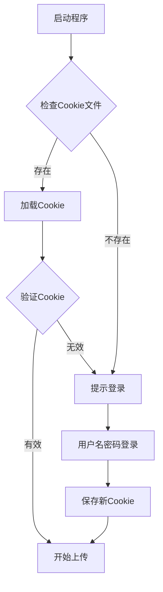

# 🎬 AcFun 命令行投稿工具

> 现代化的 AcFun 视频投稿命令行工具，支持 Cookie 复用，告别重复登录！

[](https://www.python.org/)
[](LICENSE)
[]()

## ✨ 特性

- 🚀 **现代化架构** - 纯 Python 原生库，轻量级无冗余依赖
- 🍪 **智能 Cookie 管理** - 类似 yt-dlp 的 Cookie 机制，支持浏览器导出格式
- ⚡ **即开即用** - 无需安装，直接运行脚本
- 🔐 **智能登录** - 优先使用 Cookie，失效时自动提示密码登录
- 📝 **完整功能** - 支持视频、封面、标题、简介、标签、频道等全部投稿参数
- 🛡️ **稳定上传** - 完善的错误处理和网络重试机制
- 🔧 **批量处理** - 支持批量上传多个视频

## 📋 环境要求

- **Python**: 3.7 或更高版本
- **系统**: Windows / Linux / macOS
- **网络**: 稳定的互联网连接

## 🚀 快速开始

### 1. 克隆项目
```bash
git clone https://github.com/your-username/acfun_upload.git
cd acfun_upload
```

### 2. 安装依赖
```bash
pip install -r requirements.txt
```

### 3. 开始使用
```bash
# 首次使用 - 会提示输入用户名密码
python acfun_cli.py video.mp4 -c cover.png -t "我的第一个视频" --cid 63

# 后续使用 - 自动使用保存的 Cookie
python acfun_cli.py video2.mp4 -c cover2.png -t "我的第二个视频" --cid 63
```

## 📖 使用指南

### 基本语法
```bash
python acfun_cli.py <视频文件> -c <封面图片> -t <标题> --cid <频道ID> [其他选项]
```

### 完整示例
```bash
python acfun_cli.py gameplay.mp4 \
  --cover thumbnail.png \
  --title "【原神】新角色试玩体验" \
  --cid 63 \
  --desc "今天来试玩一下新出的角色，感觉还不错！" \
  --tags "原神" "游戏" "试玩" \
  --type 3
```

## 🔧 命令行参数

### 必需参数
| 参数 | 说明 | 示例 |
|------|------|------|
| `file_path` | 视频文件路径 | `video.mp4` |
| `-c, --cover` | 封面图片路径 | `-c cover.png` |
| `-t, --title` | 视频标题 | `-t "我的视频"` |
| `--cid` | 频道ID | `--cid 63` |

### 可选参数
| 参数 | 说明 | 默认值 | 示例 |
|------|------|--------|------|
| `-d, --desc` | 视频简介 | 空 | `-d "视频描述"` |
| `--tags` | 标签列表 | 空 | `--tags "游戏" "实况"` |
| `--type` | 创作类型 | 3 (原创) | `--type 1` (转载) |
| `--original_url` | 转载来源 | 空 | `--original_url "https://..."` |
| `-u, --username` | 用户名 | 自动提示 | `-u "myusername"` |
| `-p, --password` | 密码 | 安全输入 | `-p "mypassword"` |
| `--cookie_file` | Cookie文件路径 | `cookies/ac_cookies.txt` | `--cookie_file "my.txt"` |

### 频道ID参考
| 频道 | ID | 频道 | ID |
|------|----|----- |----|
| 🎮 游戏 | 63 | 📺 动画 | 1 |
| 🎵 音乐 | 58 | 🎭 娱乐 | 164 |
| 🏠 生活 | 73 | 🎨 绘画 | 75 |
| 🍳 美食 | 76 | 🐾 动物 | 77 |

> 💡 更多频道ID请查看 AcFun 官方投稿页面

## 🍪 Cookie 管理

### 自动Cookie管理
程序会自动管理Cookie，实现以下流程：



### 支持的Cookie格式

#### 1. Netscape格式（推荐）
从浏览器导出的标准格式，兼容性最好：
```
# Netscape HTTP Cookie File
.acfun.cn	TRUE	/	FALSE	1640995200	token	your_token_here
```

#### 2. JSON格式
程序自动保存的格式：
```json
[
  {
    "name": "token",
    "value": "your_token_here",
    "domain": ".acfun.cn",
    "path": "/"
  }
]
```

### 从浏览器导出Cookie

#### Chrome/Edge
1. 安装 [Get cookies.txt LOCALLY](https://chrome.google.com/webstore/detail/get-cookiestxt-locally/cclelndahbckbenkjhflpdbgdldlbecc) 扩展
2. 访问 [AcFun](https://www.acfun.cn) 并登录
3. 点击扩展图标，选择 "Export" → "Netscape format"
4. 保存为 `cookies/ac_cookies.txt`

#### Firefox
1. 安装 [cookies.txt](https://addons.mozilla.org/en-US/firefox/addon/cookies-txt/) 扩展
2. 访问 [AcFun](https://www.acfun.cn) 并登录
3. 点击扩展图标导出Cookie
4. 保存为 `cookies/ac_cookies.txt`

## 📁 项目结构

```
acfun_upload/
├── 📄 acfun_cli.py          # 主程序脚本
├── 📄 example.py            # 使用示例
├── 📄 batch_upload.py       # 批量上传工具
├── 📁 cookies/              # Cookie存储目录
│   └── 📄 ac_cookies.txt    # Cookie文件（自动生成）
├── 📁 uploads/              # 上传文件目录（可选）
├── 📄 requirements.txt      # 依赖列表
├── 📄 .gitignore           # Git忽略文件
├── 📄 README.md            # 项目说明
└── 📄 LICENSE              # 开源协议
```

## 🔨 高级用法

### 批量上传
使用提供的批量上传脚本：
```bash
python batch_upload.py
```

或者自定义批量脚本：
```bash
#!/bin/bash
for video in videos/*.mp4; do
    cover="${video%.mp4}.png"
    title=$(basename "$video" .mp4)
    python acfun_cli.py "$video" -c "$cover" -t "$title" --cid 63
    sleep 10  # 避免请求过快
done
```

### 使用配置文件
创建 `config.json` 文件：
```json
{
    "channel_id": 63,
    "tags": ["游戏", "实况"],
    "type": 3,
    "cookie_file": "cookies/my_cookies.txt"
}
```

### 环境变量
支持通过环境变量设置默认值：
```bash
export ACFUN_USERNAME="your_username"
export ACFUN_CHANNEL_ID="63"
python acfun_cli.py video.mp4 -c cover.png -t "标题"
```

## 🛠️ 故障排除

### 常见问题

#### ❌ Cookie失效
**症状**: 提示登录失败或认证错误
**解决方案**:
```bash
# 删除旧Cookie文件
rm cookies/ac_cookies.txt
# 重新运行程序
python acfun_cli.py video.mp4 -c cover.png -t "标题" --cid 63
```

#### ❌ 上传失败
**症状**: 网络错误或上传中断
**解决方案**:
1. 检查网络连接稳定性
2. 确认视频格式支持（MP4推荐）
3. 检查文件大小限制
4. 尝试更换网络环境

#### ❌ SSL错误
**症状**: `SSLError` 或证书验证失败
**解决方案**:
```bash
# 程序会自动重试并跳过SSL验证
# 或者手动设置环境变量
export PYTHONHTTPSVERIFY=0
python acfun_cli.py video.mp4 -c cover.png -t "标题" --cid 63
```

#### ❌ 依赖问题
**症状**: 模块导入错误
**解决方案**:
```bash
# 使用虚拟环境
python -m venv venv
# Windows
venv\Scripts\activate
# Linux/macOS
source venv/bin/activate
# 安装依赖
pip install -r requirements.txt
```

### 调试模式
添加详细日志输出：
```bash
python -u acfun_cli.py video.mp4 -c cover.png -t "标题" --cid 63 2>&1 | tee upload.log
```

## 🤝 贡献指南

欢迎贡献代码！请遵循以下步骤：

1. **Fork** 本仓库
2. 创建特性分支: `git checkout -b feature/amazing-feature`
3. 提交更改: `git commit -m 'Add amazing feature'`
4. 推送分支: `git push origin feature/amazing-feature`
5. 提交 **Pull Request**

### 开发环境设置
```bash
git clone https://github.com/your-username/acfun_upload.git
cd acfun_upload
python -m venv venv
source venv/bin/activate  # Windows: venv\Scripts\activate
pip install -r requirements.txt
```

## 📄 许可证

本项目采用 [GNU General Public License v3.0](LICENSE) 开源协议。